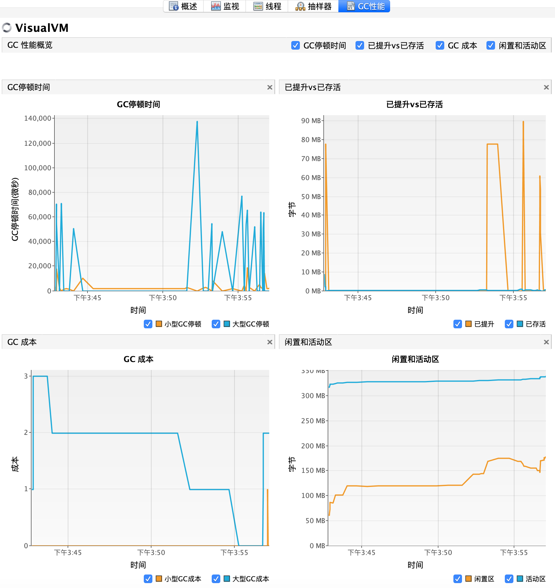

# gcperf
Visual VM 垃圾回收性能监控插件, 加入对最新版VisualVM 2.0的支持, 做了简单的汉化.

原始项目: https://github.com/bitcharmer/gcperf

原始介绍: https://dzone.com/articles/visualvm-gcviewer-plugin

**下载**

gcperf.nbm 中文多语言版

 gcperf_en.nbm 英文版

 [Java 8(VisualVM 1.0)适用](visualvm1\dist) 

 [VisualVM 2.0适用](visualvm2\dist) 

------

术语简单解释:

参考 JDK 源码: AdaptiveSizePolicy.Design.txt 

   活动区 liveSpace = baseFootprint + oldAlive + youngAlive
   闲置区 freeSpace = promoSize + edenSize

 **重要说明:** 此项目仅支持 OpenJDK 和 Hotspot, 通过使用 [JVMStat API](http://openjdk.java.net/groups/serviceability/jvmstat/overview-tree.html) 来读取内置的 HotSpot 计数器. 因为某些原因, 新的并行GC (*-XX:+UseParNewGC*) 不再提供和旧的并行扫描收集器(*-XX:+UseParallelGC*)相同的计数器, 所以新版下只能看到 GC 暂停时间和已提升对比已存活两个图表 . 

其它的GC算法能否显示暂未测试.

运行截图:

英文截图:

